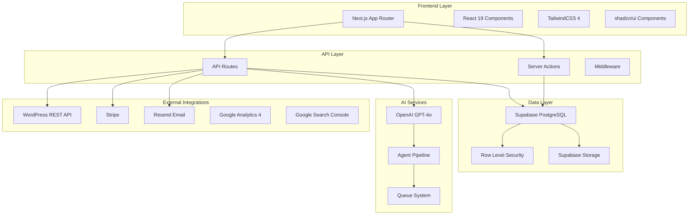
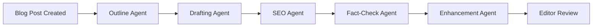
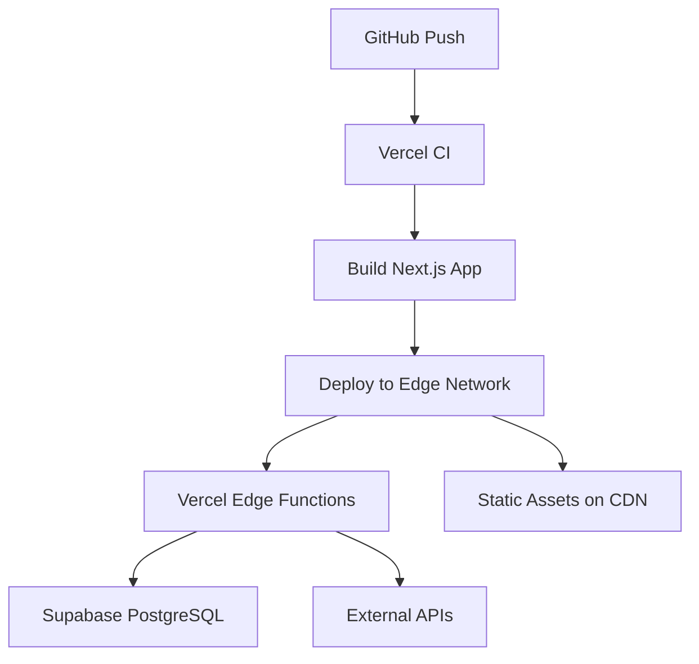

# System Architecture - BlogCanvas

Comprehensive overview of BlogCanvas system architecture, design patterns, and technical decisions.

---

## Table of Contents

1. [High-Level Overview](#high-level-overview)
2. [Technology Stack](#technology-stack)
3. [Architecture Patterns](#architecture-patterns)
4. [Frontend Architecture](#frontend-architecture)
5. [Backend Architecture](#backend-architecture)
6. [Database Architecture](#database-architecture)
7. [AI Pipeline Architecture](#ai-pipeline-architecture)
8. [Security Architecture](#security-architecture)
9. [Integration Architecture](#integration-architecture)
10. [Deployment Architecture](#deployment-architecture)
11. [Performance Optimization](#performance-optimization)
12. [Monitoring & Observability](#monitoring--observability)

---

## High-Level Overview

BlogCanvas is a modern, multi-tenant SaaS platform for managing SEO content at scale. The system follows a **serverless-first** architecture built on Next.js 16 with the App Router.

### System Diagram



### Core Principles

1. **Serverless-First** - No traditional backend servers, everything runs on Vercel edge
2. **Multi-Tenant by Design** - Complete data isolation using RLS
3. **API-First** - Every feature exposed as REST API
4. **Progressive Enhancement** - Core features work without JavaScript
5. **Type Safety** - End-to-end TypeScript with generated types
6. **Real-Time Ready** - Built on Supabase Realtime subscriptions

---

## Technology Stack

### Frontend

| Technology | Version | Purpose |
|------------|---------|---------|
| **Next.js** | 16.x | React framework with App Router |
| **React** | 19.x | UI library |
| **TypeScript** | 5.x | Type safety |
| **TailwindCSS** | 4.x | Utility-first CSS |
| **shadcn/ui** | Latest | Component library |
| **Radix UI** | Latest | Accessible primitives |
| **React Hook Form** | 7.x | Form management |
| **Zod** | 3.x | Schema validation |

### Backend

| Technology | Version | Purpose |
|------------|---------|---------|
| **Next.js API Routes** | 16.x | REST API endpoints |
| **Next.js Server Actions** | 16.x | Server-side mutations |
| **Supabase** | Latest | Database + Auth + Storage |
| **PostgreSQL** | 15.x | Primary database |
| **Supabase RLS** | - | Row-level security |

### AI & ML

| Technology | Purpose |
|------------|---------|
| **OpenAI GPT-4o** | Content generation (drafts, outlines) |
| **OpenAI GPT-4o-mini** | SEO optimization, fact-checking |
| **Custom Agent Pipeline** | Multi-stage content processing |

### Integrations

| Service | Purpose |
|---------|---------|
| **Stripe** | Payment processing, subscriptions |
| **Resend** | Transactional emails |
| **WordPress REST API** | Content publishing |
| **Google Analytics 4** | Traffic analytics |
| **Google Search Console** | SEO performance data |

### Development Tools

| Tool | Purpose |
|------|---------|
| **pnpm** | Package management |
| **ESLint** | Code linting |
| **Prettier** | Code formatting |
| **Husky** | Git hooks |
| **GitHub Actions** | CI/CD |

---

## Architecture Patterns

### 1. Multi-Tenancy Pattern

BlogCanvas uses **shared database, isolated by RLS** multi-tenancy:

```
┌─────────────────────────────────────────┐
│         Single Database                  │
├─────────────────────────────────────────┤
│  Client A Data  │  Client B Data  │ ... │
│  (RLS enforced) │  (RLS enforced) │     │
└─────────────────────────────────────────┘
```

**Benefits:**
- Cost-effective (single database)
- Simple backups and migrations
- PostgreSQL-level isolation via RLS
- Easy to scale horizontally

**Implementation:**

```typescript
// All tables include client_id
CREATE TABLE blog_posts (
  id uuid PRIMARY KEY,
  client_id uuid REFERENCES clients(id),
  -- other columns
);

// RLS Policy enforces tenant isolation
CREATE POLICY "Users see only their client's posts"
  ON blog_posts FOR SELECT
  USING (
    client_id IN (
      SELECT client_id FROM client_profiles WHERE id = auth.uid()
    )
  );
```

### 2. Role-Based Access Control (RBAC)

Four primary roles with hierarchical permissions:

```
vendor_admin (highest)
  ├── vendor_editor
  ├── client_admin
  └── client_reviewer (lowest)
```

**Permission Matrix:**

| Feature | vendor_admin | vendor_editor | client_admin | client_reviewer |
|---------|--------------|---------------|--------------|-----------------|
| Manage clients | ✅ | ❌ | ❌ | ❌ |
| Create content | ✅ | ✅ | ❌ | ❌ |
| Edit content | ✅ | ✅ | ❌ | ❌ |
| Review content | ✅ | ✅ | ✅ | ✅ |
| Approve content | ✅ | ✅ | ✅ | ❌ |
| Publish content | ✅ | ✅ | ❌ | ❌ |
| View analytics | ✅ | ✅ | ✅ | ❌ |
| Billing settings | ✅ | ❌ | ✅ | ❌ |

### 3. Repository Pattern

Data access abstracted through service layers:

```typescript
// Service layer handles business logic
export async function createBlogPost(data: BlogPostInsert) {
  const supabase = createClient()

  // Validation
  if (!data.title || data.title.length < 10) {
    throw new Error('Title must be at least 10 characters')
  }

  // Business logic
  const slug = generateSlug(data.title)

  // Database operation
  const { data: post, error } = await supabase
    .from('blog_posts')
    .insert({ ...data, slug })
    .select()
    .single()

  if (error) throw error

  // Post-creation hooks
  await queueOutlineGeneration(post.id)

  return post
}
```

### 4. Event-Driven Architecture

System uses event-driven patterns for decoupling:

```typescript
// Event emission
await emitEvent('blog_post.status_changed', {
  post_id: post.id,
  old_status: 'draft',
  new_status: 'client_review'
})

// Event handlers
eventBus.on('blog_post.status_changed', async (event) => {
  if (event.new_status === 'client_review') {
    await notifyClient(event.post_id)
  }
})
```

**Use Cases:**
- Status transitions trigger notifications
- Post published → schedule check-backs
- Batch completed → generate report
- Webhook delivery

### 5. Queue-Based Processing

Long-running tasks use queue system:

```typescript
// Enqueue AI generation job
await queuePipelineJob({
  blog_post_id: post.id,
  job_type: 'generate_draft',
  priority: 5,
  scheduled_for: new Date()
})

// Worker processes jobs
async function processJob(job: PipelineJob) {
  await updateJobStatus(job.id, 'running')

  try {
    const result = await generateDraft(job.blog_post_id)
    await saveRevision(job.blog_post_id, result)
    await updateJobStatus(job.id, 'completed')
  } catch (error) {
    await retryOrFail(job, error)
  }
}
```

---

## Frontend Architecture

### Next.js App Router Structure

```
src/app/
├── (auth)/                 # Auth pages (login, register)
│   ├── auth/
│   │   ├── client/         # Client portal login
│   │   └── vendor/         # Vendor login
│
├── (vendor)/               # Vendor portal
│   └── app/                # Main vendor app
│       ├── clients/        # Client management
│       ├── batches/        # Content batches
│       ├── posts/          # Blog post editing
│       ├── analytics/      # Analytics dashboard
│       └── settings/       # Settings pages
│
├── (client)/               # Client portal
│   └── portal/
│       ├── posts/          # Review blog posts
│       ├── batches/        # View content batches
│       ├── brand/          # Brand guide
│       └── analytics/      # View analytics
│
└── api/                    # API routes
    ├── clients/            # Client CRUD
    ├── blog-posts/         # Blog post CRUD
    ├── content-batches/    # Batch management
    ├── publish/            # Publishing endpoints
    └── analytics/          # Analytics endpoints
```

### Component Architecture

```
src/components/
├── ui/                     # shadcn/ui primitives
│   ├── button.tsx
│   ├── dialog.tsx
│   └── ...
│
├── clients/                # Client-specific components
│   ├── ClientList.tsx
│   ├── ClientForm.tsx
│   └── ClientCard.tsx
│
├── posts/                  # Blog post components
│   ├── PostEditor.tsx
│   ├── PostList.tsx
│   ├── RevisionHistory.tsx
│   └── DiffViewer.tsx
│
├── batches/                # Content batch components
│   ├── BatchDashboard.tsx
│   ├── BatchProgress.tsx
│   └── CSVImportModal.tsx
│
└── website/                # Website analysis components
    ├── AuditDashboard.tsx
    ├── TopicClusters.tsx
    └── PitchBuilderTab.tsx
```

### State Management

BlogCanvas uses **server-first state management**:

1. **Server State** - Managed by Supabase queries
2. **Form State** - React Hook Form
3. **UI State** - React useState/useReducer
4. **Global State** - Minimal, only for user session

**Example:**

```typescript
'use client'

import { useQuery } from '@tanstack/react-query'

export function BlogPostList() {
  // Server state via React Query
  const { data: posts, isLoading } = useQuery({
    queryKey: ['blog-posts'],
    queryFn: async () => {
      const supabase = createClient()
      const { data } = await supabase
        .from('blog_posts')
        .select('*')
        .order('created_at', { ascending: false })
      return data
    }
  })

  if (isLoading) return <Skeleton />

  return <PostTable posts={posts} />
}
```

### Real-Time Updates

```typescript
'use client'

import { useEffect } from 'react'
import { createClient } from '@/lib/supabase/client'

export function RealtimePosts() {
  const supabase = createClient()

  useEffect(() => {
    const channel = supabase
      .channel('blog-posts-changes')
      .on('postgres_changes', {
        event: '*',
        schema: 'public',
        table: 'blog_posts'
      }, (payload) => {
        console.log('Post changed:', payload)
        // Update UI
      })
      .subscribe()

    return () => {
      supabase.removeChannel(channel)
    }
  }, [])

  return <PostList />
}
```

---

## Backend Architecture

### API Route Structure

```typescript
// /app/api/blog-posts/[id]/route.ts

import { NextResponse } from 'next/server'
import { createClient, requireAuth } from '@/lib/supabase/server'

// GET /api/blog-posts/:id
export async function GET(
  request: Request,
  { params }: { params: { id: string } }
) {
  try {
    // Auth check
    await requireAuth()
    const supabase = createClient()

    // Fetch data (RLS enforced automatically)
    const { data: post, error } = await supabase
      .from('blog_posts')
      .select('*, content_batches(*), blog_post_revisions(*)')
      .eq('id', params.id)
      .single()

    if (error) throw error
    if (!post) {
      return NextResponse.json(
        { error: 'Post not found' },
        { status: 404 }
      )
    }

    return NextResponse.json({ success: true, post })
  } catch (error: any) {
    return NextResponse.json(
      { error: error.message },
      { status: 500 }
    )
  }
}

// PATCH /api/blog-posts/:id
export async function PATCH(
  request: Request,
  { params }: { params: { id: string } }
) {
  try {
    await requireAuth()
    const supabase = createClient()

    const body = await request.json()

    // Update post
    const { data: post, error } = await supabase
      .from('blog_posts')
      .update(body)
      .eq('id', params.id)
      .select()
      .single()

    if (error) throw error

    // Trigger events
    await emitEvent('blog_post.updated', { post_id: post.id })

    return NextResponse.json({ success: true, post })
  } catch (error: any) {
    return NextResponse.json(
      { error: error.message },
      { status: 500 }
    )
  }
}
```

### Server Actions

```typescript
// /app/actions/blog-posts.ts
'use server'

import { createClient, requireAuth } from '@/lib/supabase/server'
import { revalidatePath } from 'next/cache'

export async function updateBlogPostStatus(
  postId: string,
  status: string
) {
  await requireAuth()
  const supabase = createClient()

  const { error } = await supabase
    .from('blog_posts')
    .update({ status })
    .eq('id', postId)

  if (error) throw error

  // Revalidate cache
  revalidatePath('/app/posts')
  revalidatePath(`/app/posts/${postId}`)

  return { success: true }
}
```

### Middleware

```typescript
// /middleware.ts

import { createServerClient } from '@supabase/ssr'
import { NextResponse } from 'next/server'
import type { NextRequest } from 'next/server'

export async function middleware(request: NextRequest) {
  let response = NextResponse.next()

  const supabase = createServerClient(
    process.env.NEXT_PUBLIC_SUPABASE_URL!,
    process.env.NEXT_PUBLIC_SUPABASE_ANON_KEY!,
    {
      cookies: {
        get: (name) => request.cookies.get(name)?.value,
        set: (name, value, options) => {
          response.cookies.set({ name, value, ...options })
        }
      }
    }
  )

  const { data: { user } } = await supabase.auth.getUser()

  // Protect vendor routes
  if (request.nextUrl.pathname.startsWith('/app')) {
    if (!user) {
      return NextResponse.redirect(new URL('/auth/vendor', request.url))
    }
  }

  // Protect client portal
  if (request.nextUrl.pathname.startsWith('/portal')) {
    if (!user) {
      return NextResponse.redirect(new URL('/auth/client', request.url))
    }
  }

  return response
}

export const config = {
  matcher: ['/app/:path*', '/portal/:path*']
}
```

---

## Database Architecture

### Schema Design Principles

1. **Normalized Design** - 3NF for core tables
2. **Denormalization Where Needed** - Counter columns for performance
3. **JSONB for Flexibility** - Metadata and configuration
4. **Timestamps Everywhere** - created_at, updated_at on all tables
5. **Soft Deletes** - deleted_at for important entities

### Key Design Decisions

#### 1. UUID Primary Keys

```sql
CREATE TABLE blog_posts (
  id uuid PRIMARY KEY DEFAULT gen_random_uuid(),
  -- columns...
);
```

**Why UUIDs:**
- Globally unique (no collisions)
- Can be generated client-side
- No sequential ID disclosure
- Easier for distributed systems

#### 2. Counter Columns

```sql
CREATE TABLE content_batches (
  id uuid PRIMARY KEY,
  total_posts integer DEFAULT 0,
  posts_completed integer DEFAULT 0,
  posts_approved integer DEFAULT 0,
  posts_published integer DEFAULT 0
);

-- Trigger to update counters
CREATE FUNCTION update_batch_counters()
RETURNS TRIGGER AS $$
BEGIN
  IF TG_OP = 'INSERT' THEN
    UPDATE content_batches
    SET total_posts = total_posts + 1
    WHERE id = NEW.content_batch_id;
  ELSIF TG_OP = 'UPDATE' THEN
    IF OLD.status != NEW.status THEN
      -- Update appropriate counter
    END IF;
  END IF;
  RETURN NEW;
END;
$$ LANGUAGE plpgsql;
```

**Why Counter Columns:**
- Avoid COUNT(*) queries on large tables
- Real-time dashboard updates
- Trade-off: complexity for performance

#### 3. JSONB Metadata

```sql
CREATE TABLE blog_post_revisions (
  id uuid PRIMARY KEY,
  metadata jsonb DEFAULT '{}'::jsonb
);

-- Query JSONB
SELECT * FROM blog_post_revisions
WHERE metadata->>'agent' = 'seo_agent';

-- Index JSONB
CREATE INDEX idx_revisions_agent
  ON blog_post_revisions USING gin((metadata->'agent'));
```

**Why JSONB:**
- Flexible schema for agent outputs
- Efficient querying with GIN indexes
- Store nested data structures

### Indexing Strategy

```sql
-- Multi-column indexes for common queries
CREATE INDEX idx_blog_posts_client_status
  ON blog_posts(client_id, status);

CREATE INDEX idx_blog_posts_batch_status
  ON blog_posts(content_batch_id, status)
  WHERE content_batch_id IS NOT NULL;

-- Partial indexes for specific filters
CREATE INDEX idx_blog_posts_published
  ON blog_posts(published_at)
  WHERE status = 'published';

-- Full-text search indexes
CREATE INDEX idx_blog_posts_title_search
  ON blog_posts USING gin(to_tsvector('english', title));

-- Foreign key indexes (crucial for joins)
CREATE INDEX idx_blog_post_revisions_post
  ON blog_post_revisions(blog_post_id);
```

---

## AI Pipeline Architecture

### 5-Agent Pipeline



### Agent Implementation

```typescript
// /lib/ai/agents/outline-agent.ts

export async function generateOutline(
  postId: string,
  options: OutlineOptions = {}
) {
  const post = await fetchBlogPost(postId)
  const brandGuide = await fetchBrandGuide(post.client_id)

  // Create agent run record
  const agentRun = await createAgentRun({
    blog_post_id: postId,
    agent_name: 'outline',
    status: 'running'
  })

  try {
    // Build prompt
    const prompt = buildOutlinePrompt({
      title: post.title,
      keyword: post.target_keyword,
      brandVoice: brandGuide.brand_voice,
      ...options
    })

    // Call OpenAI
    const response = await openai.chat.completions.create({
      model: 'gpt-4o',
      messages: [
        { role: 'system', content: OUTLINE_SYSTEM_PROMPT },
        { role: 'user', content: prompt }
      ],
      temperature: 0.7,
      max_tokens: 2000
    })

    const outline = JSON.parse(response.choices[0].message.content)

    // Save revision
    await createRevision({
      blog_post_id: postId,
      revision_type: 'outline',
      content: JSON.stringify(outline),
      metadata: {
        agent: 'outline_agent',
        model: 'gpt-4o',
        tokens: response.usage.total_tokens,
        cost: calculateCost(response.usage)
      }
    })

    // Update agent run
    await updateAgentRun(agentRun.id, {
      status: 'completed',
      output_tokens: response.usage.completion_tokens,
      cost: calculateCost(response.usage)
    })

    return outline
  } catch (error) {
    await updateAgentRun(agentRun.id, {
      status: 'failed',
      error_message: error.message
    })
    throw error
  }
}
```

### Queue System

```typescript
// /lib/queue/pipeline-queue.ts

export async function queuePipelineJob(job: PipelineJobInput) {
  const supabase = createClient()

  const { data, error } = await supabase
    .from('pipeline_jobs')
    .insert({
      blog_post_id: job.blog_post_id,
      job_type: job.job_type,
      priority: job.priority || 50,
      status: 'pending',
      scheduled_for: job.scheduled_for || new Date(),
      attempts: 0
    })
    .select()
    .single()

  if (error) throw error

  return data
}

// Worker (runs on cron or continuously)
export async function processPipelineJobs() {
  const supabase = createClient()

  // Get next pending job
  const { data: jobs } = await supabase
    .from('pipeline_jobs')
    .select('*')
    .eq('status', 'pending')
    .lte('scheduled_for', new Date().toISOString())
    .order('priority', { ascending: true })
    .order('scheduled_for', { ascending: true })
    .limit(1)

  if (!jobs || jobs.length === 0) return

  const job = jobs[0]

  // Mark as running
  await supabase
    .from('pipeline_jobs')
    .update({ status: 'running' })
    .eq('id', job.id)

  try {
    // Process job
    await processJob(job)

    // Mark complete
    await supabase
      .from('pipeline_jobs')
      .update({ status: 'completed', completed_at: new Date() })
      .eq('id', job.id)
  } catch (error) {
    // Retry or fail
    if (job.attempts < 3) {
      await supabase
        .from('pipeline_jobs')
        .update({
          status: 'pending',
          attempts: job.attempts + 1,
          scheduled_for: new Date(Date.now() + 60000) // 1 min retry
        })
        .eq('id', job.id)
    } else {
      await supabase
        .from('pipeline_jobs')
        .update({
          status: 'failed',
          error_message: error.message
        })
        .eq('id', job.id)
    }
  }
}
```

---

## Security Architecture

### Row Level Security (RLS)

Every table has RLS policies enforcing tenant isolation:

```sql
-- Enable RLS
ALTER TABLE blog_posts ENABLE ROW LEVEL SECURITY;

-- SELECT policy - see only your client's data
CREATE POLICY "Users see their client's posts"
  ON blog_posts FOR SELECT
  USING (
    client_id IN (
      SELECT client_id
      FROM client_profiles
      WHERE id = auth.uid()
    )
  );

-- INSERT policy - vendors can create
CREATE POLICY "Vendors can create posts"
  ON blog_posts FOR INSERT
  WITH CHECK (
    EXISTS (
      SELECT 1
      FROM client_profiles
      WHERE id = auth.uid()
        AND client_id = blog_posts.client_id
        AND role IN ('vendor_admin', 'vendor_editor')
    )
  );

-- UPDATE policy - role-based
CREATE POLICY "Appropriate roles can update posts"
  ON blog_posts FOR UPDATE
  USING (
    EXISTS (
      SELECT 1
      FROM client_profiles
      WHERE id = auth.uid()
        AND client_id = blog_posts.client_id
        AND (
          role IN ('vendor_admin', 'vendor_editor')
          OR (role = 'client_admin' AND blog_posts.status = 'client_review')
        )
    )
  );
```

### Authentication Flow

```typescript
// Vendor login
const { data, error } = await supabase.auth.signInWithPassword({
  email: 'vendor@example.com',
  password: 'password'
})

// Client invitation token
const { data, error } = await supabase.auth.signInWithOtp({
  email: 'client@example.com',
  options: {
    data: {
      invitation_token: token,
      role: 'client_admin'
    }
  }
})

// Server-side auth check
export async function requireAuth() {
  const supabase = createClient()
  const { data: { user } } = await supabase.auth.getUser()

  if (!user) {
    throw new Error('Unauthorized')
  }

  return user
}

// Server-side role check
export async function requireRole(allowedRoles: string[]) {
  const user = await requireAuth()
  const supabase = createClient()

  const { data: profile } = await supabase
    .from('client_profiles')
    .select('role')
    .eq('id', user.id)
    .single()

  if (!profile || !allowedRoles.includes(profile.role)) {
    throw new Error('Forbidden')
  }

  return profile
}
```

### Input Validation

```typescript
import { z } from 'zod'

// Schema definition
const createBlogPostSchema = z.object({
  client_id: z.string().uuid(),
  title: z.string().min(10).max(200),
  target_keyword: z.string().min(2).max(100),
  content_batch_id: z.string().uuid().optional(),
  due_date: z.string().datetime().optional()
})

// API route validation
export async function POST(request: Request) {
  const body = await request.json()

  // Validate input
  const result = createBlogPostSchema.safeParse(body)

  if (!result.success) {
    return NextResponse.json(
      { error: 'Validation failed', details: result.error.errors },
      { status: 400 }
    )
  }

  // Process validated data
  const validatedData = result.data
  // ...
}
```

### API Rate Limiting

```typescript
// /lib/rate-limit.ts

import { Ratelimit } from '@upstash/ratelimit'
import { Redis } from '@upstash/redis'

const redis = new Redis({
  url: process.env.UPSTASH_REDIS_URL!,
  token: process.env.UPSTASH_REDIS_TOKEN!
})

const ratelimit = new Ratelimit({
  redis: redis,
  limiter: Ratelimit.slidingWindow(100, '1 h')
})

export async function checkRateLimit(identifier: string) {
  const { success, limit, reset, remaining } = await ratelimit.limit(identifier)

  return {
    allowed: success,
    limit,
    remaining,
    resetAt: new Date(reset)
  }
}

// Usage in API route
export async function GET(request: Request) {
  const user = await requireAuth()

  const { allowed, remaining, resetAt } = await checkRateLimit(user.id)

  if (!allowed) {
    return NextResponse.json(
      { error: 'Rate limit exceeded' },
      {
        status: 429,
        headers: {
          'X-RateLimit-Remaining': remaining.toString(),
          'X-RateLimit-Reset': resetAt.toISOString()
        }
      }
    )
  }

  // Process request...
}
```

---

## Integration Architecture

### WordPress Publishing

```typescript
// /lib/wordpress/publisher.ts

export async function publishToWordPress(
  postId: string,
  connectionId: string
) {
  // Fetch post and connection
  const post = await fetchBlogPost(postId)
  const connection = await fetchCMSConnection(connectionId)

  // Build WordPress payload
  const payload = {
    title: post.title,
    content: post.content,
    status: 'publish',
    slug: post.slug,
    excerpt: post.meta_description,
    categories: [connection.default_category_id],
    tags: connection.default_tags,
    meta: {
      _yoast_wpseo_metadesc: post.meta_description,
      _yoast_wpseo_focuskw: post.target_keyword
    }
  }

  // Authenticate with WordPress
  const auth = Buffer.from(
    `${connection.credentials.username}:${connection.credentials.application_password}`
  ).toString('base64')

  // Publish post
  const response = await fetch(`${connection.site_url}/wp-json/wp/v2/posts`, {
    method: 'POST',
    headers: {
      'Authorization': `Basic ${auth}`,
      'Content-Type': 'application/json'
    },
    body: JSON.stringify(payload)
  })

  if (!response.ok) {
    throw new Error(`WordPress publish failed: ${response.statusText}`)
  }

  const result = await response.json()

  // Update post record
  await updateBlogPost(postId, {
    status: 'published',
    cms_url: result.link,
    published_at: new Date()
  })

  return result
}
```

### Google Analytics 4 Integration

```typescript
// /lib/analytics/ga4.ts

import { BetaAnalyticsDataClient } from '@google-analytics/data'

export async function fetchGA4Metrics(
  propertyId: string,
  postUrl: string,
  startDate: string,
  endDate: string
) {
  const analyticsDataClient = new BetaAnalyticsDataClient({
    credentials: JSON.parse(process.env.GA4_CREDENTIALS!)
  })

  const [response] = await analyticsDataClient.runReport({
    property: `properties/${propertyId}`,
    dateRanges: [{ startDate, endDate }],
    dimensions: [{ name: 'pagePath' }],
    metrics: [
      { name: 'sessions' },
      { name: 'averageSessionDuration' },
      { name: 'conversions' }
    ],
    dimensionFilter: {
      filter: {
        fieldName: 'pagePath',
        stringFilter: {
          matchType: 'EXACT',
          value: new URL(postUrl).pathname
        }
      }
    }
  })

  // Parse response
  const row = response.rows?.[0]

  return {
    sessions: parseInt(row?.metricValues?.[0]?.value || '0'),
    avg_time_on_page: parseInt(row?.metricValues?.[1]?.value || '0'),
    conversions: parseInt(row?.metricValues?.[2]?.value || '0')
  }
}
```

---

## Deployment Architecture

### Vercel Deployment



**Configuration:** `vercel.json`

```json
{
  "buildCommand": "npm run build",
  "outputDirectory": ".next",
  "framework": "nextjs",
  "regions": ["iad1", "sfo1"],
  "env": {
    "NEXT_PUBLIC_SUPABASE_URL": "@supabase-url",
    "NEXT_PUBLIC_SUPABASE_ANON_KEY": "@supabase-anon-key",
    "SUPABASE_SERVICE_ROLE_KEY": "@supabase-service-key",
    "OPENAI_API_KEY": "@openai-key",
    "STRIPE_SECRET_KEY": "@stripe-secret"
  }
}
```

### Database Hosting

**Supabase Cloud:**
- Managed PostgreSQL 15
- Automatic backups (daily)
- Point-in-time recovery (7 days)
- Connection pooling (PgBouncer)
- Read replicas (production tier)

---

## Performance Optimization

### 1. Database Query Optimization

```typescript
// Bad: N+1 queries
for (const post of posts) {
  const batch = await fetchBatch(post.content_batch_id)
  // ...
}

// Good: Join query
const { data: posts } = await supabase
  .from('blog_posts')
  .select('*, content_batches(*)')
```

### 2. Caching Strategy

```typescript
// /lib/cache.ts

const queryCache = new Map<string, { data: any; timestamp: number }>()
const CACHE_TTL = 60000 // 1 minute

export function queryCache.get(key: string) {
  const cached = queryCache.get(key)

  if (!cached) return null

  const age = Date.now() - cached.timestamp
  if (age > CACHE_TTL) {
    queryCache.delete(key)
    return null
  }

  return cached.data
}

export function queryCache.set(key: string, data: any) {
  queryCache.set(key, {
    data,
    timestamp: Date.now()
  })
}

// Usage
export async function fetchClients(page: number) {
  const cacheKey = `clients:${page}`

  const cached = queryCache.get(cacheKey)
  if (cached) return cached

  const data = await supabase.from('clients').select('*')
  queryCache.set(cacheKey, data)

  return data
}
```

### 3. Image Optimization

```typescript
import Image from 'next/image'

// Automatic optimization with Next.js Image
<Image
  src="/uploads/hero.jpg"
  alt="Blog post hero"
  width={1200}
  height={630}
  quality={85}
  priority
/>
```

### 4. Code Splitting

```typescript
// Dynamic imports for heavy components
import dynamic from 'next/dynamic'

const DiffViewer = dynamic(() => import('@/components/DiffViewer'), {
  loading: () => <Skeleton />,
  ssr: false
})
```

---

## Monitoring & Observability

### Logging

```typescript
// /lib/logger.ts

export const logger = {
  info: (message: string, meta?: any) => {
    console.log(JSON.stringify({
      level: 'info',
      message,
      timestamp: new Date().toISOString(),
      ...meta
    }))
  },

  error: (message: string, error: Error, meta?: any) => {
    console.error(JSON.stringify({
      level: 'error',
      message,
      error: {
        name: error.name,
        message: error.message,
        stack: error.stack
      },
      timestamp: new Date().toISOString(),
      ...meta
    }))
  }
}

// Usage
logger.info('Blog post created', { postId, clientId })
logger.error('WordPress publish failed', error, { postId, connectionId })
```

### Error Tracking

Integration with Sentry or similar:

```typescript
// /lib/sentry.ts

import * as Sentry from '@sentry/nextjs'

Sentry.init({
  dsn: process.env.SENTRY_DSN,
  tracesSampleRate: 0.1,
  environment: process.env.VERCEL_ENV || 'development'
})

// Usage
try {
  await publishPost(postId)
} catch (error) {
  Sentry.captureException(error, {
    tags: { feature: 'publishing' },
    extra: { postId }
  })
  throw error
}
```

---

## Related Documentation

- [Database Schema](./DATABASE_SCHEMA.md) - Complete database structure
- [API Reference](./API_REFERENCE.md) - REST API documentation
- [Contribution Guide](./CONTRIBUTING.md) - Development workflow

---

**Last Updated:** 2026-01-15
**Architecture Version:** 2.0
**System Scale:** Multi-tenant SaaS, 1000+ clients supported
