# Database Schema - BlogCanvas

## Overview

BlogCanvas uses PostgreSQL (via Supabase) with Row Level Security (RLS) enabled on all tables. The schema is organized into several logical groups that support the content retainer workflow.

**Total Tables:** 60+ tables across 8 major functional areas

---

## Schema ERD (Entity Relationship Diagram)

```mermaid
erDiagram
    %% Core Authentication & Tenancy
    clients ||--o{ client_profiles : has
    clients ||--o{ websites : owns
    clients ||--o{ blog_posts : commissions
    clients ||--o{ content_batches : has

    %% Website Analysis
    websites ||--o{ website_pages : contains
    websites ||--o{ scraped_pages : "crawled as"
    websites ||--o{ seo_audits : "audited in"
    websites ||--o{ topic_clusters : "generates"
    websites ||--o{ website_insights : "analyzed for"

    %% SEO Retainer System
    seo_audits }o--|| websites : "audits"
    topic_clusters }o--|| websites : "clusters for"
    content_batches }o--|| websites : "plans for"
    content_batches ||--o{ blog_posts : contains

    %% Content Production
    blog_posts }o--|| content_batches : "part of"
    blog_posts }o--|| topic_clusters : "targets"
    blog_posts ||--o{ blog_post_sections : "structured as"
    blog_posts ||--o{ blog_post_revisions : "tracked in"
    blog_posts ||--o{ blog_post_metrics : "measured by"
    blog_posts ||--o{ comments : "discussed in"
    blog_posts ||--o{ review_tasks : "reviewed via"

    %% AI Pipeline
    blog_posts ||--o{ agent_runs : "processed by"
    blog_posts ||--o{ pipeline_jobs : "queued in"
    agent_runs ||--o{ agent_outputs : "produces"

    %% Brand Management
    clients ||--o{ brand_guides : has
    brand_guides ||--o{ products_services : documents
    brand_guides ||--o{ faqs : includes
    brand_guides ||--o{ comparison_tables : contains
    brand_guides ||--o{ content_requirements : specifies
    brand_guides ||--o{ post_requirements : defines
    brand_guides ||--o{ uploaded_documents : references

    %% Publishing
    clients ||--o{ cms_connections : configures
    blog_posts }o--|| cms_connections : "publishes via"
    blog_posts ||--o{ publish_queue : "scheduled in"

    %% Analytics & Reporting
    websites ||--o{ reports : generates
    blog_posts ||--o{ check_back_schedules : monitors
    websites ||--o{ ga4_properties : "tracks with"
    websites ||--o{ gsc_properties : "monitors in"

    %% Client Collaboration
    clients ||--o{ client_approvals : "approves via"
    blog_posts ||--o{ client_change_requests : "requests changes to"
    blog_posts ||--o{ editor_sign_offs : "approved by"

    %% System Features
    clients ||--o{ newsletters : sends
    clients ||--o{ transactional_emails : receives
    clients ||--o{ api_keys : manages
    clients ||--o{ webhooks : configures
    clients ||--o{ audit_logs : "tracked in"
```



---

## Core Tables

### Authentication & Multi-Tenancy

#### `clients`
Primary tenant table - represents a content agency or brand.

| Column | Type | Description |
|--------|------|-------------|
| id | uuid | Primary key |
| name | text | Company name |
| email | text | Primary contact email |
| created_at | timestamptz | Account creation |
| stripe_customer_id | text | Stripe integration |
| subscription_status | text | active/trialing/canceled |

**RLS:** Enforced based on auth.uid() matching client owner

#### `client_profiles`
Extended profile information for client users.

| Column | Type | Description |
|--------|------|-------------|
| id | uuid | Primary key (references auth.users) |
| client_id | uuid | FK → clients.id |
| role | text | vendor_admin/vendor_editor/client_admin/client_reviewer |
| full_name | text | Display name |
| avatar_url | text | Profile picture |

---

## Website Analysis System

### `websites`
Represents a client's website being managed.

| Column | Type | Description |
|--------|------|-------------|
| id | uuid | Primary key |
| client_id | uuid | FK → clients.id |
| url | text | Website URL |
| platform | text | wordpress/shopify/custom |
| seo_score | integer | Current SEO score (0-100) |
| last_crawled_at | timestamptz | Last crawl timestamp |
| pages_indexed | integer | Number of pages found |

**Key Relationships:**
- `websites` → `seo_audits` (one-to-many)
- `websites` → `topic_clusters` (one-to-many)
- `websites` → `content_batches` (one-to-many)

### `website_pages`
Individual pages discovered on the website.

| Column | Type | Description |
|--------|------|-------------|
| id | uuid | Primary key |
| website_id | uuid | FK → websites.id |
| url | text | Full page URL |
| title | text | Page title |
| word_count | integer | Content length |
| status | text | active/404/redirect |

### `scraped_pages`
Raw crawl data from website analysis.

| Column | Type | Description |
|--------|------|-------------|
| id | uuid | Primary key |
| website_id | uuid | FK → websites.id |
| url | text | Page URL |
| content | text | Extracted content |
| meta_description | text | Meta tag |
| h1_tags | text[] | Header tags |
| scraped_at | timestamptz | Crawl timestamp |

---

## SEO Retainer System (PRD Core)

### `seo_audits`
Baseline and follow-up SEO audits.

| Column | Type | Description |
|--------|------|-------------|
| id | uuid | Primary key |
| website_id | uuid | FK → websites.id |
| baseline_score | integer | Starting SEO score |
| pages_indexed | integer | Pages found |
| audit_date | timestamptz | Audit timestamp |
| raw_metrics_json | jsonb | Full audit data |
| recommendations | text[] | Improvement suggestions |

**Purpose:** Tracks SEO improvement over time, powers pitch builder forecasts.

### `topic_clusters`
Content gap analysis and opportunity mapping.

| Column | Type | Description |
|--------|------|-------------|
| id | uuid | Primary key |
| website_id | uuid | FK → websites.id |
| name | text | Cluster name (e.g., "Product Features") |
| primary_keyword | text | Main keyword |
| estimated_traffic | integer | Monthly search volume |
| difficulty | integer | SEO difficulty (0-100) |
| currently_covered | boolean | Has existing content? |
| recommended_posts | integer | Suggested article count |

**Purpose:** Gap analysis, topic recommendations for content batches.

### `content_batches`
Content packages/retainer agreements.

| Column | Type | Description |
|--------|------|-------------|
| id | uuid | Primary key |
| website_id | uuid | FK → websites.id |
| name | text | Batch name |
| goal_score_from | integer | Starting SEO score |
| goal_score_to | integer | Target SEO score |
| start_date | date | Batch start |
| end_date | date | Batch completion target |
| status | text | planned/in_progress/completed |
| total_posts | integer | Post count |
| posts_completed | integer | Completion counter |
| posts_approved | integer | Approval counter |
| posts_published | integer | Publish counter |

**Purpose:** Represents a content retainer package (e.g., "Q1 2026 - 20 posts").

---

## Content Production

### `blog_posts`
Core content entity - represents a single blog post.

| Column | Type | Description |
|--------|------|-------------|
| id | uuid | Primary key |
| client_id | uuid | FK → clients.id |
| content_batch_id | uuid | FK → content_batches.id (nullable) |
| topic_cluster_id | uuid | FK → topic_clusters.id (nullable) |
| title | text | Post title |
| slug | text | URL slug |
| target_keyword | text | Primary keyword |
| status | text | ai_drafting/editor_review/client_review/approved/published |
| seo_quality_score | integer | SEO score for this post (0-100) |
| cms_url | text | Published URL |
| published_at | timestamptz | Publish timestamp |
| due_date | date | Target completion date |
| search_intent | text | informational/transactional/navigational |

**Status Flow:**
```
ai_drafting → editor_review → client_review → approved → published
```

**Purpose:** Central entity for content workflow.

### `blog_post_revisions`
Full version history for blog posts.

| Column | Type | Description |
|--------|------|-------------|
| id | uuid | Primary key |
| blog_post_id | uuid | FK → blog_posts.id |
| revision_type | text | outline/draft/seo_pass/fact_check/human_edit |
| content | text | Full content snapshot |
| created_by | uuid | FK → client_profiles.id (nullable for AI) |
| created_at | timestamptz | Revision timestamp |
| metadata | jsonb | Agent parameters, change notes |

**Purpose:** Tracks every version of a post through the AI pipeline and human edits.

### `blog_post_sections`
Structured content sections (for outline-based editing).

| Column | Type | Description |
|--------|------|-------------|
| id | uuid | Primary key |
| blog_post_id | uuid | FK → blog_posts.id |
| order_index | integer | Section order |
| type | text | heading/paragraph/list/table |
| content | text | Section content |
| heading_level | integer | H2/H3/H4 (if type=heading) |

---

## AI Content Pipeline

### `agent_runs`
Tracks AI agent executions.

| Column | Type | Description |
|--------|------|-------------|
| id | uuid | Primary key |
| blog_post_id | uuid | FK → blog_posts.id |
| agent_name | text | outline/draft/seo/fact_check/enhancement |
| status | text | running/completed/failed |
| started_at | timestamptz | Start time |
| completed_at | timestamptz | End time (nullable) |
| input_tokens | integer | Token usage |
| output_tokens | integer | Token usage |
| cost | numeric | USD cost |

**Purpose:** Monitors AI agent performance and costs.

### `agent_outputs`
Stores structured outputs from AI agents.

| Column | Type | Description |
|--------|------|-------------|
| id | uuid | Primary key |
| agent_run_id | uuid | FK → agent_runs.id |
| output_type | text | outline/draft/seo_improvements/facts |
| content | jsonb | Structured output |
| confidence_score | numeric | AI confidence (0-1) |

### `pipeline_jobs`
Queue system for background AI processing.

| Column | Type | Description |
|--------|------|-------------|
| id | uuid | Primary key |
| blog_post_id | uuid | FK → blog_posts.id |
| job_type | text | generate_outline/generate_draft/etc |
| status | text | pending/running/completed/failed |
| priority | integer | 0=highest, 100=lowest |
| scheduled_for | timestamptz | When to run |
| attempts | integer | Retry counter |
| error_message | text | Failure reason (nullable) |

---

## Brand Management

### `brand_guides`
Client brand voice, style, and guidelines.

| Column | Type | Description |
|--------|------|-------------|
| id | uuid | Primary key |
| client_id | uuid | FK → clients.id |
| company_name | text | Brand name |
| brand_voice | text | Tone description |
| target_audience | text | Audience description |
| key_messages | text[] | Core messaging |
| do_not_mention | text[] | Prohibited topics |

**Related Tables:**
- `products_services` - Product catalog
- `faqs` - Common questions
- `comparison_tables` - Competitive positioning
- `content_requirements` - Content guidelines
- `post_requirements` - Post-level requirements
- `uploaded_documents` - Reference materials

---

## Publishing System

### `cms_connections`
CMS integration credentials.

| Column | Type | Description |
|--------|------|-------------|
| id | uuid | Primary key |
| client_id | uuid | FK → clients.id |
| platform | text | wordpress/contentful/etc |
| site_url | text | CMS URL |
| auth_type | text | application_password/oauth/api_key |
| credentials | jsonb | Encrypted credentials |
| is_active | boolean | Connection status |

### `publish_queue`
Scheduled publishing queue.

| Column | Type | Description |
|--------|------|-------------|
| id | uuid | Primary key |
| blog_post_id | uuid | FK → blog_posts.id |
| cms_connection_id | uuid | FK → cms_connections.id |
| scheduled_for | timestamptz | Publish time |
| status | text | pending/published/failed |
| retry_count | integer | Attempt counter |
| error_message | text | Failure reason (nullable) |

---

## Analytics & Reporting

### `blog_post_metrics`
Time-series performance data for published posts.

| Column | Type | Description |
|--------|------|-------------|
| id | uuid | Primary key |
| blog_post_id | uuid | FK → blog_posts.id |
| snapshot_date | date | Measurement date |
| impressions | integer | Search impressions |
| clicks | integer | Click count |
| avg_position | numeric | Average SERP position |
| seo_score | integer | SEO score at this time |
| sessions | integer | GA4 sessions |
| avg_time_on_page | integer | Time in seconds |
| conversions | integer | Goal completions |

**Purpose:** Powers check-back reports (Day 7, 30, 60, 90).

### `check_back_schedules`
Automated check-back scheduling.

| Column | Type | Description |
|--------|------|-------------|
| id | uuid | Primary key |
| blog_post_id | uuid | FK → blog_posts.id |
| check_date | date | Scheduled check date |
| interval_days | integer | 7/30/60/90 |
| status | text | pending/completed/skipped |
| completed_at | timestamptz | Completion time (nullable) |

### `reports`
Generated client reports (PDF, slides, email).

| Column | Type | Description |
|--------|------|-------------|
| id | uuid | Primary key |
| website_id | uuid | FK → websites.id |
| report_type | text | email/pdf/slide |
| period_start | date | Report start date |
| period_end | date | Report end date |
| generated_by | uuid | FK → client_profiles.id |
| generated_at | timestamptz | Generation time |
| storage_url | text | File location |

---

## Client Collaboration

### `comments`
Threaded comments on blog posts.

| Column | Type | Description |
|--------|------|-------------|
| id | uuid | Primary key |
| blog_post_id | uuid | FK → blog_posts.id |
| parent_comment_id | uuid | FK → comments.id (for threading) |
| author_id | uuid | FK → client_profiles.id |
| content | text | Comment text |
| is_resolved | boolean | Resolution status |
| created_at | timestamptz | Comment time |

### `review_tasks`
Review workflow tasks.

| Column | Type | Description |
|--------|------|-------------|
| id | uuid | Primary key |
| blog_post_id | uuid | FK → blog_posts.id |
| assigned_to | uuid | FK → client_profiles.id |
| task_type | text | editor_review/client_approval |
| status | text | pending/in_progress/completed |
| due_date | date | Deadline |
| completed_at | timestamptz | Completion time (nullable) |

### `client_approvals`
Client approval tracking.

| Column | Type | Description |
|--------|------|-------------|
| id | uuid | Primary key |
| blog_post_id | uuid | FK → blog_posts.id |
| approved_by | uuid | FK → client_profiles.id |
| approval_status | text | approved/rejected/changes_requested |
| feedback | text | Client notes |
| approved_at | timestamptz | Decision time |

### `client_change_requests`
Client-requested changes.

| Column | Type | Description |
|--------|------|-------------|
| id | uuid | Primary key |
| blog_post_id | uuid | FK → blog_posts.id |
| requested_by | uuid | FK → client_profiles.id |
| change_type | text | content/seo/style/factual |
| description | text | Change details |
| status | text | pending/in_progress/completed/rejected |
| created_at | timestamptz | Request time |
| resolved_at | timestamptz | Resolution time (nullable) |

### `editor_sign_offs`
Internal editor approval before client review.

| Column | Type | Description |
|--------|------|-------------|
| id | uuid | Primary key |
| blog_post_id | uuid | FK → blog_posts.id |
| editor_id | uuid | FK → client_profiles.id |
| signed_off_at | timestamptz | Sign-off time |
| notes | text | Editor notes |

---

## Integration Tables

### `ga4_properties`
Google Analytics 4 integration.

| Column | Type | Description |
|--------|------|-------------|
| id | uuid | Primary key |
| website_id | uuid | FK → websites.id |
| property_id | text | GA4 property ID |
| measurement_id | text | GA4 measurement ID |
| credentials | jsonb | Encrypted OAuth credentials |

### `gsc_properties`
Google Search Console integration.

| Column | Type | Description |
|--------|------|-------------|
| id | uuid | Primary key |
| website_id | uuid | FK → websites.id |
| property_url | text | GSC property URL |
| credentials | jsonb | Encrypted OAuth credentials |
| last_synced_at | timestamptz | Last data fetch |

### `wordpress_connections`
WordPress-specific publishing metadata.

| Column | Type | Description |
|--------|------|-------------|
| id | uuid | Primary key |
| cms_connection_id | uuid | FK → cms_connections.id |
| default_author_id | integer | WordPress author ID |
| default_category_id | integer | WordPress category ID |
| default_tags | text[] | Default tags to apply |

---

## System Administration

### `api_keys`
API key management for integrations.

| Column | Type | Description |
|--------|------|-------------|
| id | uuid | Primary key |
| client_id | uuid | FK → clients.id |
| key_name | text | Descriptive name |
| key_hash | text | Hashed key value |
| scopes | text[] | Permissions |
| last_used_at | timestamptz | Last usage |
| expires_at | timestamptz | Expiration (nullable) |

### `webhooks`
Webhook configuration for integrations.

| Column | Type | Description |
|--------|------|-------------|
| id | uuid | Primary key |
| client_id | uuid | FK → clients.id |
| event_type | text | post_published/batch_completed/etc |
| url | text | Webhook endpoint |
| secret | text | Signing secret |
| is_active | boolean | Enabled/disabled |

### `audit_logs`
System activity auditing.

| Column | Type | Description |
|--------|------|-------------|
| id | uuid | Primary key |
| client_id | uuid | FK → clients.id |
| actor_id | uuid | FK → client_profiles.id |
| action | text | Action performed |
| resource_type | text | Table name |
| resource_id | uuid | Record ID |
| changes | jsonb | Before/after snapshot |
| ip_address | text | Request IP |
| created_at | timestamptz | Event time |

---

## Security & RLS

All tables have Row Level Security (RLS) enabled with policies enforcing:

1. **Multi-tenancy isolation** - Users can only access data for their client_id
2. **Role-based access** - Different permissions for vendor_admin, vendor_editor, client_admin, client_reviewer
3. **Ownership verification** - Users can only modify records they created (unless admin)

### RLS Policy Pattern

```sql
-- Example: blog_posts RLS policy
CREATE POLICY "Users can view posts for their client"
  ON blog_posts FOR SELECT
  USING (
    client_id IN (
      SELECT client_id
      FROM client_profiles
      WHERE id = auth.uid()
    )
  );

CREATE POLICY "Vendor admins can insert posts"
  ON blog_posts FOR INSERT
  WITH CHECK (
    EXISTS (
      SELECT 1
      FROM client_profiles
      WHERE id = auth.uid()
        AND client_id = blog_posts.client_id
        AND role IN ('vendor_admin', 'vendor_editor')
    )
  );
```

---

## Indexes

Key indexes for performance:

```sql
-- Multi-column indexes for common queries
CREATE INDEX idx_blog_posts_client_status
  ON blog_posts(client_id, status);

CREATE INDEX idx_blog_posts_batch
  ON blog_posts(content_batch_id, status);

-- Foreign key indexes
CREATE INDEX idx_blog_post_revisions_post
  ON blog_post_revisions(blog_post_id, created_at DESC);

-- Search indexes
CREATE INDEX idx_blog_posts_title_search
  ON blog_posts USING gin(to_tsvector('english', title));
```

---

## Migration Strategy

Migrations are timestamped SQL files in `/supabase/migrations/`:

**Naming convention:** `YYYYMMDDHHMMSS_description.sql`

**Key migrations:**
- `20241204000000_initial_schema.sql` - Core tables
- `20241204000006_seo_retainer_system.sql` - PRD tables
- `20260110000001_client_auth_enhancement.sql` - Auth improvements
- `20260112000003_file_system.sql` - File storage
- `20260115000001_performance_optimization.sql` - Index additions

**Apply migrations:**
```bash
npx supabase db push
```

---

## Data Integrity

### Cascade Deletes

- Deleting a `client` cascades to all owned data
- Deleting a `website` cascades to audits, clusters, batches
- Deleting a `blog_post` cascades to revisions, metrics, comments

### Soft Deletes

Some tables use soft deletes with `deleted_at` timestamps:
- `clients` (for data retention)
- `blog_posts` (for archival)

---

## Type Generation

TypeScript types are generated from the database schema:

```bash
npx supabase gen types typescript --local > src/lib/database.types.ts
```

**Usage:**
```typescript
import { Database } from '@/lib/database.types'

type BlogPost = Database['public']['Tables']['blog_posts']['Row']
type BlogPostInsert = Database['public']['Tables']['blog_posts']['Insert']
```

---

## Schema Maintenance

### Adding a New Table

1. Create migration file:
```bash
npx supabase migration new add_new_feature
```

2. Define table with RLS:
```sql
CREATE TABLE new_feature (
  id uuid PRIMARY KEY DEFAULT gen_random_uuid(),
  client_id uuid REFERENCES clients(id) ON DELETE CASCADE,
  -- columns...
  created_at timestamptz DEFAULT now()
);

ALTER TABLE new_feature ENABLE ROW LEVEL SECURITY;

CREATE POLICY "Users can view their client's records"
  ON new_feature FOR SELECT
  USING (client_id IN (SELECT client_id FROM client_profiles WHERE id = auth.uid()));
```

3. Apply migration and regenerate types:
```bash
npx supabase db push
npx supabase gen types typescript --local > src/lib/database.types.ts
```

---

## Schema Versioning

Current schema version: **v2.0** (PRD-complete)

**Version history:**
- v1.0 - Initial core system
- v1.5 - Website scraper + brand guides
- v2.0 - SEO retainer system (PRD tables)

---

## Related Documentation

- [API Documentation](./API_REFERENCE.md) - REST API endpoints
- [Architecture Overview](./ARCHITECTURE.md) - System design
- [Contribution Guide](./CONTRIBUTING.md) - Development workflow

---

**Last Updated:** 2026-01-15
**Schema Version:** 2.0
**Total Tables:** 60+
**Total Migrations:** 60+
